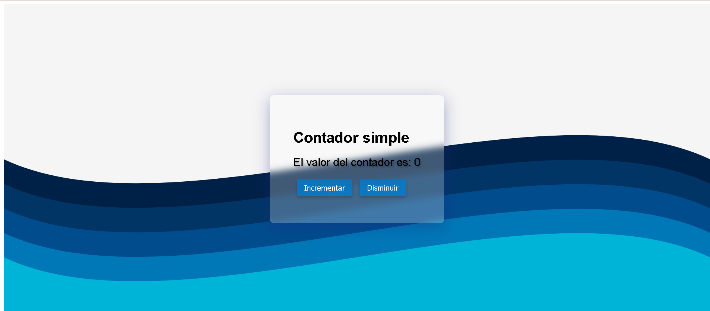

# Contador en react, con glassmorphism y efecto de fondo ondulado.

Este es un proyecto simple de contador creado con React, que utiliza efectos de **glassmorphism** y un fondo ondulado para un diseño moderno y atractivo. La aplicación incluye botones para incrementar y disminuir el valor del contador, todo dentro de un contenedor translúcido con efecto de desenfoque.
  
## Capturas de pantalla

## 📝 Características

- **Contador básico**: Incrementa o disminuye el valor del contador con botones.
- **Efecto Glassmorphism**: Contenedor translúcido con efecto de desenfoque sobre el fondo ondulado.
- **Diseño responsivo**: Se adapta a diferentes tamaños de pantalla.
- **Fondo SVG con ondas**: Fondo con un diseño de ondas en tonos azules para un aspecto relajante.

## 🚀 Tecnologías Usadas

- **React**: Biblioteca de JavaScript para crear la interfaz de usuario.
- **SASS**: Preprocesador de CSS utilizado para los estilos.
- **CSS Backdrop Filter**: Para aplicar el efecto de desenfoque en el fondo del contenedor.

## 🛠️ Funcionalidades

- **Contador**:
  - Incrementa o decrementa el valor actual al hacer clic en los botones.

- **Glassmorphism**:
  - El contenedor del contador usa un fondo translúcido con `backdrop-filter` para un efecto de desenfoque.

- **Fondo Ondulado**:
  - Se utiliza un SVG de fondo con ondas para mejorar el diseño estético.

## Estructura del proyecto 

- `src/`
  - `assets/` - Archivos como imágenes y SVGs
    - `fondo-paper-cut.svg`
  - `components/` - Componentes de React
    - `Contador.jsx`
  - `styles/` - Estilos en SASS
    - `Contador.scss`
  - `App.jsx` - Componente principal de la aplicación
  - `main.jsx` - Punto de entrada principal de React

## Licencia

Este proyecto está bajo la Licencia MIT. Consulta el archivo LICENSE para obtener más información.

## Contacto

Si tienes preguntas o deseas comunicarte conmigo, puedes enviarme un correo a [pootnicolas1@gmail.com](mailto:miemail@example.com).
